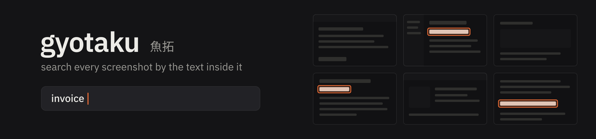

<p align="center">
  
</p>

<p align="center">
  Search every screenshot you have ever taken by the text inside it.<br>
  Native on Linux, fully offline, and fast on any hardware, with or without a GPU.
</p>

<h4 align="center">
  <a href="#installation">Installation</a> |
  <a href="docs/usage.md">Usage</a> |
  <a href="docs/troubleshooting.md">Troubleshooting</a> |
  <a href="CONTRIBUTING.md">Contributing</a>
</h4>

<p align="center">
  <a href="https://github.com/xevrion/gyotaku/actions/workflows/ci.yml"></a>
  <a href="LICENSE"></a>
  
  <a href="CONTRIBUTING.md"></a>
</p>

gyotaku reads the text in every screenshot you take and makes it searchable. Press a shortcut, type a few letters of anything you remember seeing, and every matching screenshot appears with the matched words highlighted in place. Open one to copy its text, a selection of lines, or the image itself.

All processing happens locally. gyotaku does not take screenshots itself; it indexes the folders your existing screenshot tool saves to.

## Highlights

| Metric | Result |
|---|---|
| Search latency, 5,000+ screenshots | 1 to 10 ms per keystroke |
| Screenshot saved to searchable | 0.77 s |
| Window summon time | ~120 ms |
| Frame rate with a GPU | 144 fps (display refresh rate) |
| Memory while idle in the background | 37 MB |
| Disk usage | ~28 MB per 1,000 screenshots |

It also runs without a GPU, using software rendering. All figures were measured on real hardware; see [Performance](docs/performance.md) for the full results and methodology.

## Installation

gyotaku currently supports Linux on x86_64. 64-bit ARM is expected to work but has not been tested. It is built from source.

Steps 1 to 3 are verified from a clean image of Ubuntu 22.04, Debian 12, Kali, Arch Linux, Fedora and openSUSE Tumbleweed on every commit ([CI](https://github.com/xevrion/gyotaku/actions/workflows/ci.yml)).

### 1. Install build dependencies

**Ubuntu, Debian, Kali, Linux Mint, Pop!_OS**

```sh
sudo apt install git curl build-essential pkg-config libfontconfig-dev libxkbcommon-x11-dev libwayland-dev libx11-xcb-dev
```

**Arch Linux, Manjaro, EndeavourOS**

```sh
sudo pacman -S --needed git curl base-devel fontconfig libxkbcommon-x11 wayland libxcb
```

**Fedora**

```sh
sudo dnf install git curl gcc gcc-c++ make pkgconf-pkg-config fontconfig-devel libxkbcommon-x11-devel wayland-devel libxcb-devel
```

**openSUSE**

```sh
sudo zypper install git curl gcc gcc-c++ make pkg-config fontconfig-devel libxkbcommon-x11-devel wayland-devel libxcb-devel
```

Optional: install `wl-clipboard` (Wayland) or `xclip` (X11) to enable copying images. Copying text works without them.

### 2. Install Rust

gyotaku requires Rust 1.95 or newer. Install it with [rustup](https://rustup.rs) rather than your distribution's package manager, whose version is usually older:

```sh
curl --proto '=https' --tlsv1.2 -sSf https://sh.rustup.rs | sh
```

Open a new terminal afterwards so that `cargo` is on your `PATH`. The repository's `rust-toolchain.toml` selects the correct version automatically.

### 3. Build and install

```sh
git clone https://github.com/xevrion/gyotaku && cd gyotaku
cargo install --locked --path crates/cli     # gyotaku: the indexer and command-line interface
cargo install --locked --path crates/app     # gyotaku-app: the search window
```

Both binaries are installed to `~/.cargo/bin`. The first build compiles the UI toolkit from source and takes several minutes. It requires about 3 GB of free disk space while running; the build directory is removed afterwards.

### 4. Bind a keyboard shortcut

`gyotaku-app` opens the search window. Pressing the same shortcut again closes it. Some desktop environments do not use your shell's `PATH`, so use the absolute path printed by `which gyotaku-app` (for example `/home/you/.cargo/bin/gyotaku-app`).

| Environment | Configuration |
|---|---|
| GNOME | Settings > Keyboard > View and Customize Shortcuts > Custom Shortcuts > Add |
| KDE Plasma | System Settings > Keyboard > Shortcuts > Add New > Command or Script |
| sway, i3 | `bindsym $mod+s exec gyotaku-app` |
| Hyprland | `bind = SUPER, S, exec, gyotaku-app` |
| niri | `Mod+S { spawn "gyotaku-app"; }` in the `binds` block |
| Other | Any "run a command" shortcut. `gyotaku-app` can also be run from a terminal. |

### First run

On first launch, gyotaku asks:

1. **Which folders contain your screenshots.** It suggests the save locations of common screenshot tools (Flameshot, Spectacle, ksnip, grim, Hyprshot, niri) along with `~/Pictures/Screenshots`, `~/Pictures` and `~/Desktop`, with the number of images in each.
2. **Whether to index new screenshots in the background.** If enabled, it installs a systemd user service, or an XDG autostart entry on systems without systemd.

Indexing starts immediately, newest screenshots first, at idle CPU and I/O priority. Search is available while it runs.

Before the first screenshot is read, gyotaku downloads the OCR models and ONNX Runtime once (46 MB on disk). No network access is needed after that.

### Updating

```sh
cd gyotaku && git pull
cargo install --locked --path crates/cli
cargo install --locked --path crates/app
systemctl --user restart gyotaku-watch     # restart the background indexer
pkill -x gyotaku-app                       # stop the resident window so the new version is used
```

The index, settings and thumbnails are preserved.

### Uninstalling

```sh
systemctl --user disable --now gyotaku-watch
rm -f ~/.config/systemd/user/gyotaku-watch.service ~/.config/autostart/gyotaku-watch.desktop
pkill -x gyotaku-app
cargo uninstall gyotaku gyotaku-app
rm -rf ~/.config/gyotaku ~/.local/share/gyotaku ~/.cache/gyotaku
```

Then remove the keyboard shortcut. gyotaku never modifies or deletes your screenshots.

If anything does not work as described, see [Troubleshooting](docs/troubleshooting.md).

## Usage

| Key | Action |
|---|---|
| Type | Search. Partial words match: `nutsmp` finds `donutsmp.net`. |
| Arrow keys | Move between results |
| Enter | Open the selected screenshot |
| Ctrl+C | Copy the screenshot's text, or the selected lines |
| Ctrl+Shift+C | Copy the image |
| Ctrl+, | Open settings |
| Escape | Clear the search, then close |

Every word in a query must appear somewhere in the screenshot, not necessarily on the same line. On an open screenshot, drag a box to copy only the lines inside it.

A command-line interface is also available:

```sh
gyotaku search invoice march
```

See the [usage guide](docs/usage.md) for all keys, settings and commands.

## Privacy

gyotaku runs entirely on your machine. It has no telemetry, accounts or update checks. Its only network access is the one-time download of the OCR models (from ModelScope) and ONNX Runtime (Microsoft's official build, from GitHub), each verified against a pinned SHA-256 checksum before use.

## Documentation

| Document | Contents |
|---|---|
| [Usage](docs/usage.md) | Keys, mouse controls, settings, the command-line interface, file locations |
| [Troubleshooting](docs/troubleshooting.md) | Build, launch, search, indexing and clipboard problems |
| [Compatibility](docs/compatibility.md) | Supported desktops, GPUs, distributions and CPUs, and known limitations |
| [Performance](docs/performance.md) | Measured CPU, memory, frame time and disk usage |
| [Architecture](docs/architecture.md) | How OCR, indexing and the search window work, and why |
| [Development log](notes.md) | Measurements, rejected approaches and notable bugs from development |

## Contributing

Contributions are welcome. See [CONTRIBUTING.md](CONTRIBUTING.md) for the development setup and pull request guidelines. Questions belong in [Discussions](https://github.com/xevrion/gyotaku/discussions). Report security issues as described in [SECURITY.md](SECURITY.md), not in public issues.

Testing on untested configurations is particularly valuable. GNOME, KDE Plasma, integrated GPUs, ARM and non-systemd distributions have not been verified yet. Please [submit a compatibility report](https://github.com/xevrion/gyotaku/issues/new?template=compatibility_report.yml) whether it works or not.

## Built with

- [PaddleOCR](https://github.com/PaddlePaddle/PaddleOCR) PP-OCRv6 models, run on [ONNX Runtime](https://onnxruntime.ai) via [`ort`](https://crates.io/crates/ort)
- SQLite FTS5 with the trigram tokenizer, via [`rusqlite`](https://crates.io/crates/rusqlite)
- [GPUI](https://gpui.rs), the UI framework behind the Zed editor

Text detection post-processing, line extraction, batching and decoding are implemented in this repository.

## About the name

Gyotaku (魚拓) is a traditional Japanese method of recording a catch: the fish is inked and pressed onto paper to make a lasting print. The search window borrows the idea. While you search, every screenshot is inked dark and only the matching words remain lit.

## Star history

<a href="https://star-history.com/#xevrion/gyotaku&Date">
  <picture>
    <source media="(prefers-color-scheme: dark)" srcset="https://api.star-history.com/svg?repos=xevrion/gyotaku&type=Date&theme=dark" />
    <source media="(prefers-color-scheme: light)" srcset="https://api.star-history.com/svg?repos=xevrion/gyotaku&type=Date" />
    
  </picture>
</a>

## License

gyotaku is licensed under the [GNU General Public License v3.0 or later](LICENSE).

IBM Plex Sans is bundled under the SIL Open Font License 1.1 ([`crates/app/fonts/OFL.txt`](crates/app/fonts/OFL.txt)). The PaddleOCR models are licensed under Apache-2.0; they are downloaded at runtime and not distributed with this repository.
